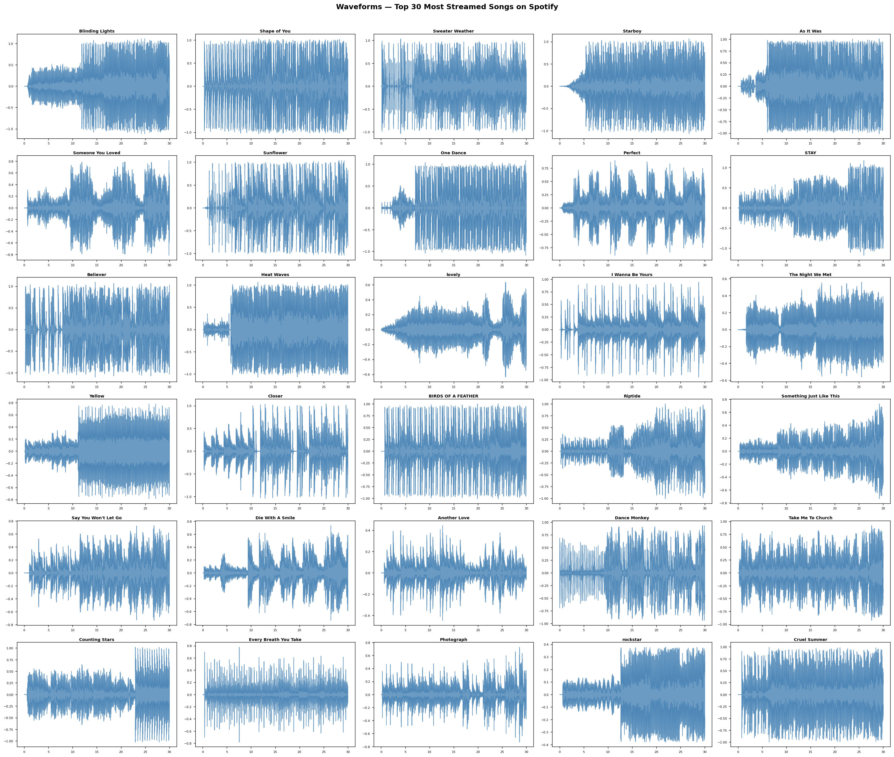
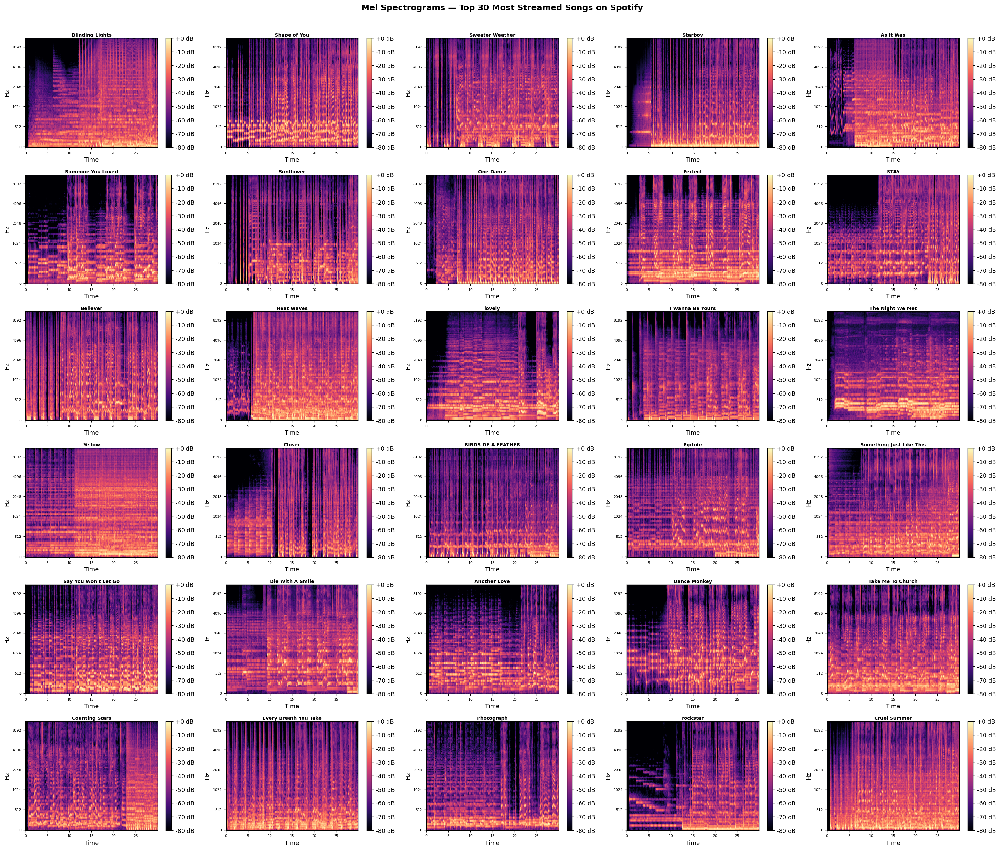
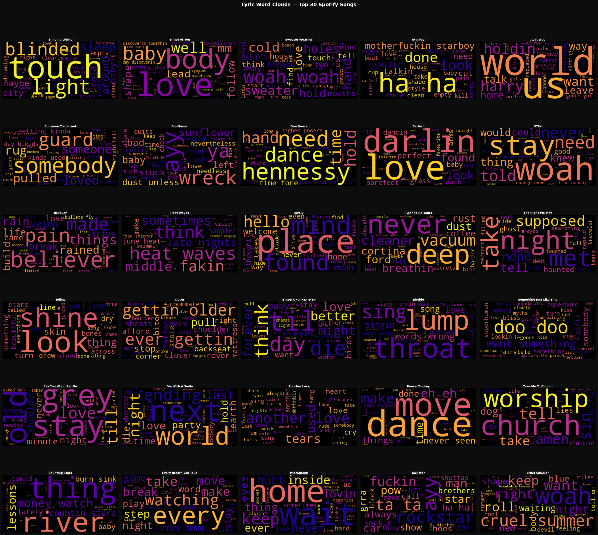
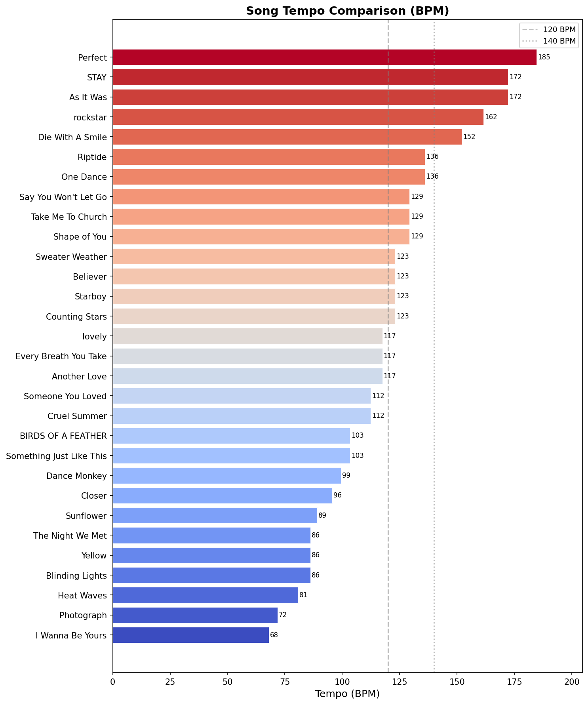
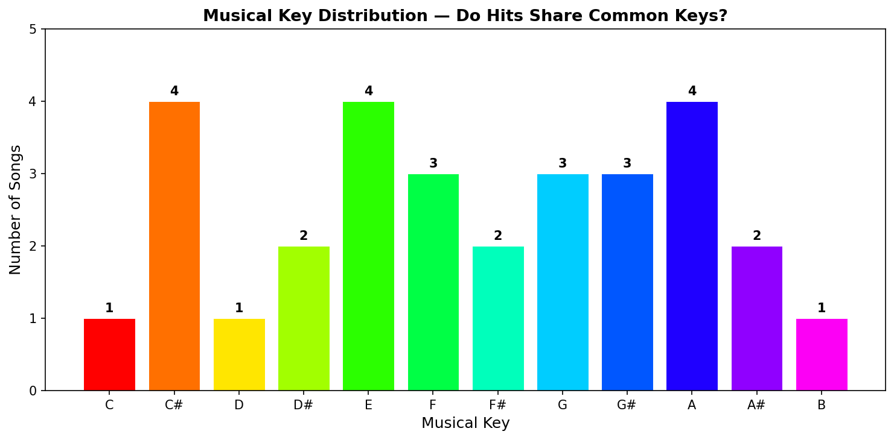
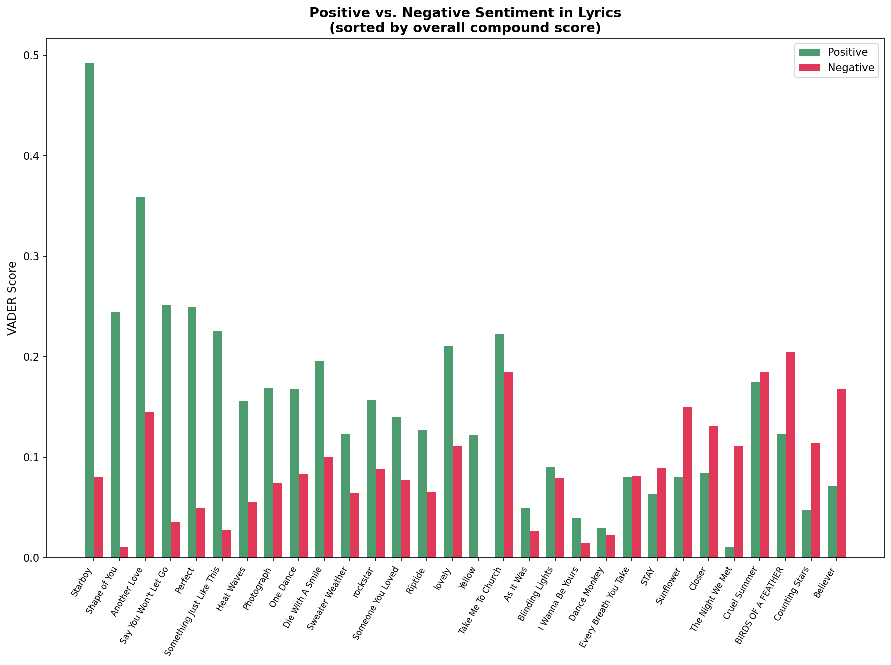
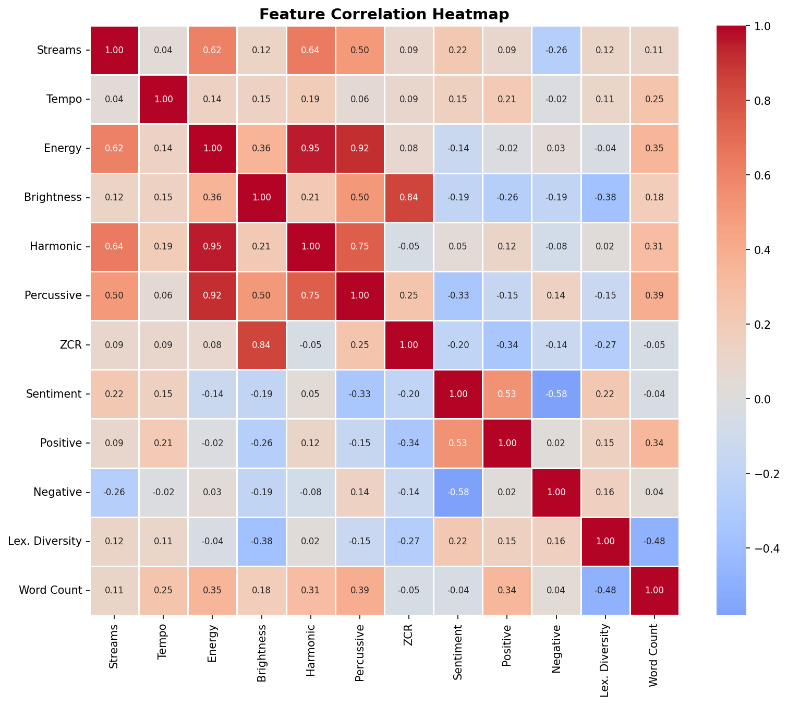
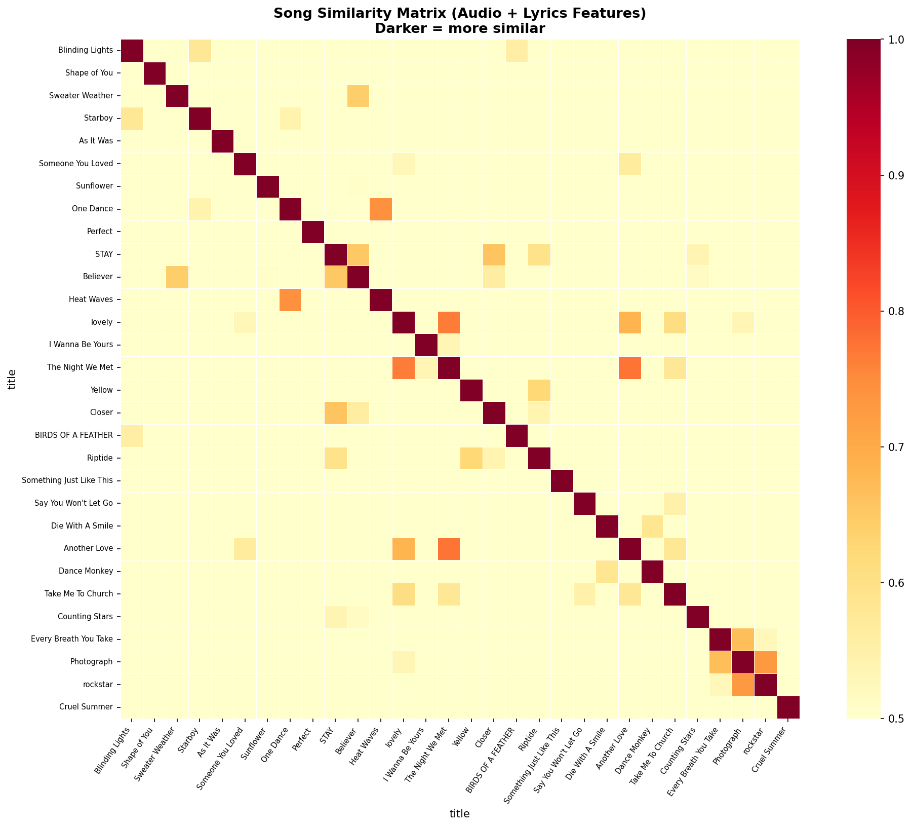

# Music Analytics — Spotify Top 30 Deep Dive

A Python data science project that analyzes the 30 most-streamed songs of all time on Spotify using audio signal processing, NLP, and machine learning. Everything runs in a single Jupyter notebook.

---

## What This Does

1. **Downloads audio** for each song from YouTube (MP3, via `yt-dlp`)
2. **Fetches lyrics** from the Genius API
3. **Analyzes the audio** with `librosa` — tempo, key, energy, spectral features, MFCCs
4. **Analyzes the lyrics** with VADER/NLTK — sentiment, vocabulary diversity, word count
5. **Clusters songs** with K-means (scikit-learn) — no genre labels, just math
6. **Generates 13 visualizations** — waveforms, spectrograms, word clouds, interactive Plotly charts

---

## Songs Analyzed

The 30 most-streamed songs on Spotify of all time (as of early 2026):

| # | Song | Artist | Streams |
|---|------|--------|---------|
| 1 | Blinding Lights | The Weeknd | 5.34B |
| 2 | Shape of You | Ed Sheeran | 4.83B |
| 3 | Sweater Weather | The Neighbourhood | 4.48B |
| 4 | Starboy | The Weeknd & Daft Punk | 4.44B |
| 5 | As It Was | Harry Styles | 4.32B |
| 6 | Someone You Loved | Lewis Capaldi | 4.27B |
| 7 | Sunflower | Post Malone & Swae Lee | 4.17B |
| 8 | One Dance | Drake | 4.12B |
| 9 | Perfect | Ed Sheeran | 3.89B |
| 10 | STAY | The Kid LAROI & Justin Bieber | 3.84B |
| ... | ... | ... | ... |
| 30 | Cruel Summer | Taylor Swift | 3.29B |

Full list in `data/songs.csv`.

---

## Key Findings

- **Blinding Lights** has a 500M stream gap over #2 — statistically alone at the top
- **Average hit tempo: 118 BPM** — the sweet spot for pop and dance music
- **Ed Sheeran** has 3 songs in the top 30, placed in 3 different clusters by the algorithm
- **Believer** (Imagine Dragons) is the most negative song on the list — and has 3.79B streams
- **Dance Monkey** has the lowest vocabulary diversity (16% unique words) — the earworm formula works
- The algorithm found **5 natural "tribes"**: Emotional Ballads, Soft Indie Rock, High-Energy Pop, Dance/Pop, Retro/Classic
- **The Night We Met** and **Another Love** are musical twins — 0.775 cosine similarity

Full blog post write-up: [blog_post.md](blog_post.md)

---

## Project Structure

```
music-analytics/
├── music_analytics.ipynb   ← main notebook (8 sections)
├── requirements.txt
├── blog_post.md            ← write-up of all findings
├── .env                    ← your Genius API token (never committed)
├── .gitignore
├── data/
│   ├── songs.csv           ← master song list with stream counts
│   ├── audio_features.csv  ← 30 songs × 28 audio features
│   └── lyrics_features.csv ← 30 songs × 14 NLP features
├── audio/                  ← MP3 files (gitignored — re-download locally)
├── lyrics/                 ← .txt lyrics files
└── visuals/                ← exported PNG and HTML charts
```

---

## Visuals

| Chart | Description |
|---|---|
|  | Audio waveform for all 30 songs |
|  | Frequency heat maps over time |
|  | Most-used words per song |
|  | BPM ranked bar chart |
|  | Most common musical keys |
|  | Positive vs negative lyrics per song |
|  | Feature correlation heatmap |
|  | Which songs sound most alike |

Interactive charts (open HTML files in browser):
- `visuals/sentiment_vs_energy.html` — mood vs intensity bubble chart
- `visuals/radar_chart.html` — 6-feature audio profile per song
- `visuals/clusters_pca.html` — the 5 song tribes in 2D
- `visuals/streams_vs_complexity.html` — do simpler songs get more streams?
- `visuals/scatter_matrix.html` — all features vs all features

---

## Setup

### Prerequisites

- Python 3.10+
- [ffmpeg](https://ffmpeg.org/download.html) installed and on your PATH (required for MP3 conversion)
  - Windows: `winget install ffmpeg`
  - macOS: `brew install ffmpeg`
  - Test: `ffmpeg -version` in terminal
- A free [Genius API token](https://genius.com/api-clients)

### Installation

```bash
# Clone the repo
git clone https://github.com/your-username/music-analytics.git
cd music-analytics

# Create and activate virtual environment
python -m venv .venv

# Windows
.venv\Scripts\activate

# macOS / Linux
source .venv/bin/activate

# Install dependencies
pip install -r requirements.txt
```

### Configure API token

Create a `.env` file in the project root:

```
GENIUS_ACCESS_TOKEN=your_token_here
```

Get a free token at [genius.com/api-clients](https://genius.com/api-clients) — create an account, click "New API Client", generate a token.

---

## Running the Notebook

Open `music_analytics.ipynb` in VS Code or JupyterLab and **Run All Cells** from the top.

The notebook is split into 8 sections:

| Section | What it does | Runtime |
|---|---|---|
| **0 — Setup** | Imports, folder creation, song list | Instant |
| **1 — Audio Download** | Downloads 30 MP3s from YouTube | ~10–20 min (runs once) |
| **2 — Lyrics Fetch** | Fetches lyrics via Genius API | ~2–3 min (runs once) |
| **3 — Audio Analysis** | Extracts audio features with librosa | ~3–8 min (runs once) |
| **4 — Lyrics NLP** | Sentiment, word stats, word clouds | ~1 min |
| **5 — Visualizations** | 5 comparative charts | ~30 sec |
| **6 — Clustering** | K-means, PCA, similarity matrix | ~30 sec |
| **7 — Summary** | Combined insights, scatter matrix | ~30 sec |

All download/fetch/analysis sections have **skip-if-exists guards** — re-running the notebook won't re-download files you already have.

---

## Tech Stack

| Purpose | Library |
|---|---|
| Audio download | `yt-dlp` + `ffmpeg` |
| Audio analysis | `librosa`, `soundfile` |
| Lyrics | `lyricsgenius` (Genius API) |
| NLP / Sentiment | `nltk` (VADER), `textblob`, `wordcloud` |
| Data | `pandas`, `numpy` |
| Visualization | `matplotlib`, `seaborn`, `plotly` |
| Clustering | `scikit-learn` |
| Config | `python-dotenv`, `tqdm`, `ipywidgets` |

---

## Notes

- Audio files are gitignored (too large). Run Section 1 to re-download them locally.
- The Genius API is free but rate-limited — the lyrics fetcher adds a 1s delay between requests.
- librosa analyzes only the first 60 seconds of each song for speed. You can change the `duration` parameter in `analyze_audio()`.
- VADER sentiment was built for social media text. It reads lyric sentiment at face value — it measures word polarity, not artistic intent.

---

## License

MIT
